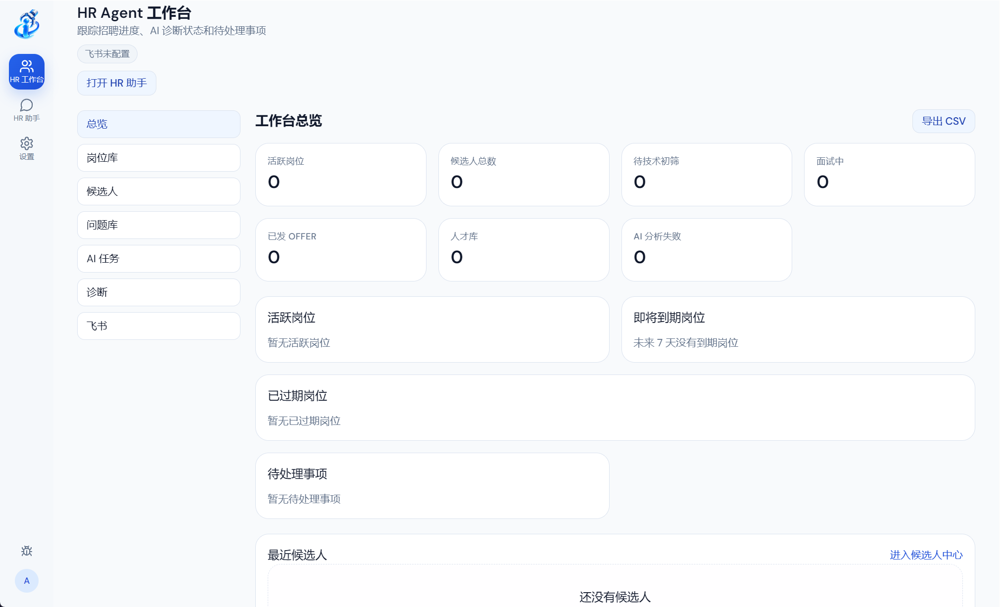
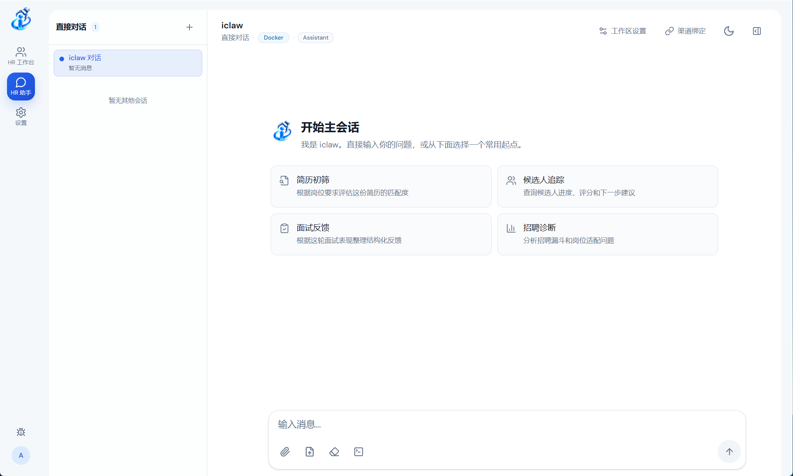
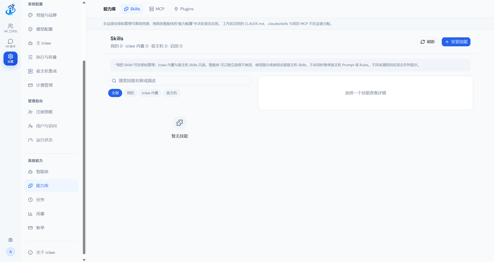
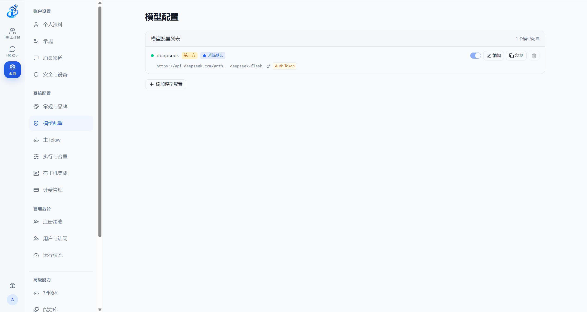

# iclaw — HR Agent 工作台

<p align="center">
  
</p>

<p align="center">
  <strong>由 Pi Agent Runtime 驱动的 HR Agent 工作台</strong><br />
  把 JD 管理、简历诊断、推面协作、面试反馈分析与飞书人才库同步组织在同一个可控工作台。
</p>

<p align="center">
  <a href="https://github.com/URBANSyndrazZ/iclaw">GitHub</a> ·
  <a href="docs/API.md">API</a> ·
  <a href="docs/ACL-MATRIX.md">权限模型</a> ·
  <a href="SECURITY.md">安全策略</a>
</p>

> 一句话：HR 在 `/hr` 完成招聘闭环；Pi Agent Runtime、Workspace、Memory、Skills、任务和多渠道触达作为底层能力支撑 HR Agent。

## 产品定位

iclaw 是一个面向个人与小型技术招聘团队的 HR Agent 工作台。产品主入口是 `/hr`，而不是通用聊天界面；招聘闭环由以下对象组成：

- JD 管理、岗位诊断与评分规则。
- 简历批量上传、HTTPS 直链导入和结构化诊断。
- 候选人中心、推面看板、面试问题库和漏斗分析。
- 一面、二面、三面反馈分析，以及 HR 审核后才激活的规则草稿。
- 飞书多维表格幂等同步，用于跨团队人才库管理。

HR Agent 使用 Pi Agent Runtime 作为可控执行底座并将包含以下能力，以扩展HR Agent的能力：

- Agent 身份、模型策略与能力配置。
- Workspace 文件、执行环境、权限和渠道绑定。
- 持久化 Session、流式输出、取消、恢复和后台运行。
- Workspace 级 Memory、Skills、MCP、Plugins 与 Subagents。
- Web、Electron Desktop、飞书、Telegram、QQ、钉钉、微信、Discord、WhatsApp 等入口。
- Cron、间隔和一次性任务，以及任务运行历史、通知与恢复。

iclaw 采用本地优先和显式集成的思路：数据库、工作区元数据、会话状态和配置由自己的服务管理；模型、消息渠道、Docker 与外部工具都作为可配置边界接入。

## 界面与体验

产品主界面围绕 HR 招聘闭环组织。左侧导航只提供 `HR 工作台`、`HR 助手` 和 `设置`；智能体、能力库、任务、用量、账单和渠道作为高级能力从设置页进入。桌面欢迎页和移动端工作区列表也提供 `HR 工作台` 快捷入口。

下面是当前桌面端工作台的实际界面：

<p align="center">
  
</p>

<p align="center">
  
</p>


<p align="center">
  <em>HR Agent：在同一个可控工作台中组织招聘业务。</em>
</p>

<p align="center">
  
  
</p>

<p align="center">
  <em>高级能力：把 Skills、MCP、Plugins 和 Provider 配置放在清晰的管理边界内。</em>
</p>

新的 iclaw 图标同时用于 Web/PWA、Electron 窗口和安装包资源：

<p align="center">
  
</p>

## 核心功能

### HR Agent Workbench

- `/hr` 提供工作台总览；岗位库、候选人中心、面试问题库、推面看板和诊断看板分别承载 JD 管理、简历检索、AI 面问题和漏斗分析。
- 岗位库和诊断看板基于现有候选人、面试轮次与 AI 任务聚合阶段转化、JD 覆盖缺口、反馈偏差、拒绝原因和失败任务。
- HR 工作台支持 PDF/DOC/DOCX/TXT/MD 简历批量上传（单文件 10MB、每批 20 个），支持服务端 HTTPS 直链导入，并可在线预览 PDF/TXT/MD 简历。
- 候选人详情支持修正姓名、按简历替换或删除；删除只移除简历文件和记录，不删除候选人、评分和面试历史。
- 上传只建档并做同岗位候选人去重；HR 手动触发单人/批量后台 AI 匹配，页面轮询分析状态。
- 面试反馈生成的岗位规则必须 HR 审核激活后才影响后续评分；AI 分析完成不自动同步飞书。
- 匹配结果强调证据链，回答“为什么推荐/不推荐、缺什么能力、哪里与 JD 矛盾”。
- 一面、二面、三面反馈以 JD 为主、反馈为辅生成规则草稿；有效偏差经 HR 审核后动态校准后续推面评分。
- 候选人和流程状态可幂等写入飞书多维表格；评分写数字，推荐结论写入带匹配等级前缀的完整匹配理由，阶段列输出中文标签，更新时间输出 UTC+8 的 `YYYY年M月D日 HH:mm:ss` 文本。
- 岗位详情支持修改 JD 标题和内容；标题变更后会批量同步该岗位候选人的飞书岗位列，JD 内容变更会归档旧评分规则。

### Agent 与 Workspace

- 用 Agent Profile 保存身份、模型、思考级别、Skills、MCP 与执行策略。
- 每个 Workspace 拥有独立的文件、Session、Memory、渠道绑定和执行边界。
- Home Workspace 与自定义 Agent 分层管理，支持创建、重命名、重建、清空和删除。
- 支持 Host 与 Docker 两种执行方式；需要隔离的任务可以在 Agent Runner 容器中运行。

### Pi Agent Runtime

- 基于 Pi Agent Runtime 提供 prompt、流式输出、工具调用、Session 持久化与恢复。
- 支持 abort、follow-up、原生 compaction 和持久化 JSONL Session。
- 复用 iclaw 已有的 MCP capability handler，并映射为稳定的 `mcp__iclaw__*` 工具。
- Subagents 通过 Pi extension 与显式的 spawn/stop 生命周期桥接。
- Runtime 不会静默假装拥有缺失能力；尚未接入 Pi 的 Web Search/Web Fetch 能力会保持明确不可用。

### Memory 与上下文

- Memory 按 Workspace 隔离，不在不同工作区之间隐式共享。
- 支持事实、偏好、决策和经验等知识类型，以及搜索、编辑、忘记和版本历史。
- 写入使用 revision 与 compare-and-set，避免并发编辑覆盖彼此的修改。
- 每条 Memory 可记录来源 Session、来源类型、观察时间和变更历史，便于回溯 provenance。
- Runtime 只注入当前 Workspace 允许使用的记忆，不把平台身份约束当作普通用户记忆。

### Skills、MCP 与 Plugins

- 内置、宿主机、项目、用户、Workspace 和 Plugin 层级的 Skills 统一解析。
- 能力库集中展示 Skills、MCP 与 Plugins 的可用状态、依赖和能力预览。
- Plugin Catalog 支持扫描、导入、版本快照和用户启用配置。
- Agent 运行前会计算有效能力 Manifest，并把 Skills、MCP、Memory、Workspace 与渠道上下文按策略注入。
- 路径穿越、符号链接逃逸、越权 Workspace 与未授权 capability 会在边界层拒绝。

### 渠道与自动化

- 支持将消息渠道绑定到指定 Workspace 或 Session，并按用户、群聊、话题和 owner 规则进行 ACL 判断。
- 保留飞书、Telegram、QQ、钉钉、微信、Discord、WhatsApp 等底层消息入口，让 HR Agent 可通过用户所在渠道响应消息。
- Scheduler 支持 Cron、固定间隔和一次性任务，提供立即运行、暂停、取消、运行历史和结果投递。
- 后台任务、Subagent 和渠道回复都沿用同一套 Workspace、Session、owner 与权限上下文。

### Electron Desktop

- Electron 只是 Desktop Shell，复用现有 Web Client，不在 Renderer 中承载数据库、文件系统、凭证、Docker 或 shell/process 权限。
- Main Process 负责窗口生命周期、外部链接、菜单和受限 IPC；Preload 只暴露白名单 API。
- 默认提供 macOS arm64 打包配置，并保留 Windows、Linux 目标配置。
- 同一套 Renderer 可以连接本地 Backend，也可以通过 `iclaw_SERVER_URL` 连接远程 iclaw 服务。

## 工作原理

```text
Web Client / Electron Desktop / Message Channels
                         │ HTTP + WebSocket / Channel Adapters
                         ▼
                iclaw Backend
        Auth · API · Queue · Scheduler · ACL
                         │
        ┌────────────────┼─────────────────┐
        ▼                ▼                 ▼
   Workspace         Capability         Channel
   Session           Registry            Binding
   Memory            Skills/MCP          Delivery
                         │
                         ▼
                 Pi Agent Runner
                   Host / Docker
                         │
                         ▼
                Pi Agent Runtime
          Tools · Extensions · Subagents
```

核心边界保持清晰：Backend 负责认证、持久化、队列、调度、渠道和授权；Pi Runner 负责 Agent 执行；Workspace 决定文件与运行边界；Electron Renderer 只负责界面和受限的桌面桥接。

## 快速开始

### 环境要求

- Node.js 20 或更高版本
- npm
- GNU Make
- 如果使用容器执行模式，需要 Docker

### 启动 Backend 与 Web Client

```bash
git clone https://github.com/URBANSyndrazZ/iclaw.git
cd iclaw

npm install
npm --prefix web install
npm --prefix container/agent-runner install

# 首次安装或依赖更新后构建 Backend、Web 与 Agent Runner
npm run build:all

# 启动生产式本地服务
npm start
```

默认地址：<http://127.0.0.1:3000>

开发模式可以直接启动 Backend 和 Vite Web Client：

```bash
npm run dev:all
```

首次进入时完成管理员初始化和 Provider 配置即可。Provider/渠道接入步骤现在可以选择“稍后设置”，跳过后仍可进入工作台，之后在设置中补齐模型和渠道配置。

Agent 容器镜像默认使用 `URBANSyndrazZ/iclaw-agent:latest`，可以通过 `iclaw_CONTAINER_IMAGE` 或 `CONTAINER_IMAGE` 覆盖。

### 启动 Electron Desktop

先启动 Backend 与 Vite：

```bash
npm run dev:all
```

再在另一个终端启动桌面端：

```bash
iclaw_RENDERER_URL=http://127.0.0.1:5173 npm run desktop:dev
```

如果直接使用 Backend 提供的构建后页面，可以省略 `iclaw_RENDERER_URL`：

```bash
npm run desktop:dev
```

连接远程 Backend 时：

```bash
iclaw_SERVER_URL=https://your-iclaw.example.com npm run desktop:dev
```

打包命令：

```bash
# 生成未安装目录，适合本地冒烟验证
npm run desktop:package:dir

# 生成当前平台的安装包
npm run desktop:package
```

打包配置位于 [`electron/electron-builder.yml`](electron/electron-builder.yml)，图标资源位于 [`electron/assets`](electron/assets)。正式发布前请为目标平台配置签名与公证。

## 常用命令

| 命令                          | 说明                                                 |
| ----------------------------- | ---------------------------------------------------- |
| `npm run dev:all`             | 启动 Backend 与 Vite Web Client                      |
| `npm run build:all`           | 构建 Backend、Web Client 与 Agent Runner             |
| `npm run typecheck`           | 检查 Backend TypeScript                              |
| `make typecheck`              | 执行 Backend、Web、Agent Runner 的完整类型与文档检查 |
| `npm test -- --run`           | 运行 Vitest 测试                                     |
| `npm run desktop:typecheck`   | 检查 Electron Main/Preload 类型                      |
| `npm run desktop:build`       | 构建 Electron Main/Preload bundle                    |
| `npm run desktop:package:dir` | 构建并生成目录形式的桌面应用                         |
| `npm run desktop:package`     | 构建并打包桌面应用                                   |
| `make backup`                 | 创建运行时数据备份                                   |
| `make restore FILE=...`       | 恢复指定备份                                         |
| `make status`                 | 查看 Backend、日志和 Docker 状态                     |
| `make stop`                   | 停止当前端口上的 iclaw 服务                          |

## 配置入口

| 环境变量                 | 用途                                                          | 默认值                             |
| ------------------------ | ------------------------------------------------------------- | ---------------------------------- |
| `iclaw_SERVER_URL`       | Electron 要连接的 Backend 地址                                | `http://127.0.0.1:3000`            |
| `iclaw_RENDERER_URL`     | Electron 要加载的 Renderer 地址，适合本地 Vite 开发           | 与 Server URL 相同                 |
| `iclaw_CONTAINER_IMAGE`  | Agent Runner 使用的容器镜像                                   | `URBANSyndrazZ/iclaw-agent:latest` |
| `CONTAINER_IMAGE`        | 容器镜像的兼容覆盖项                                          | 同上                               |
| `WEB_PORT`               | Makefile 启动 Backend 使用的端口                              | `3000`                             |
| `ICLAW_HR_MODEL`         | HR 简历解析/匹配/诊断使用的模型，例如 DeepSeek 引用           | Pi host helper 当前默认模型        |
| `ICLAW_HR_MOCK_MODEL`    | 启用 HR 稳定演示模式；固定结构化输出，不调用真实模型          | `false`                            |
| `ICLAW_SINGLE_HOST_MODE` | 单机开发/演示模式：普通成员 Home 的 Agent runtime 也使用 host | `false`                            |

不要把 API Key、Session Cookie 或其他凭证写入命令行历史、截图或提交到仓库。远程部署时使用 HTTPS/WSS，并为反向代理、Cookie 和访问控制配置独立的安全边界。

## 执行与安全边界

- Backend 由 Node.js 运行，负责认证、API、WebSocket、队列、调度、渠道连接、Provider、用量和 SQLite 持久化。
- Docker 只隔离 Agent 执行环境，不承载 Desktop UI，也不替代 Backend 的授权层。
- Electron BrowserWindow 使用 `contextIsolation`、关闭 `nodeIntegration` 和 sandbox。
- Renderer 不直接读取文件、数据库或凭据；需要本机能力时只通过受限 Preload IPC 调用。
- 外部链接由 Main Process 校验协议后打开；Renderer 导航限制在允许的 Backend/Renderer origin 内。
- Workspace ACL、owner、用户角色、系统权限和 Host 执行策略在服务端共同判定，不能因为拥有某一层权限就自动越过其他边界。
- `ICLAW_SINGLE_HOST_MODE=true` 仅用于无 Docker 的本地开发或面试演示；它放宽的是 Agent
  runtime 边界，不开放普通成员的脚本执行、host 目录挂载或其他管理员级 host 权限。
- Memory、Skills、MCP、Plugins 和 Scheduler 任务都继承用户、Agent、Workspace 与 Session 上下文。

更多权限约束见 [`docs/ACL-MATRIX.md`](docs/ACL-MATRIX.md)，安全问题请参考 [`SECURITY.md`](SECURITY.md)。

## 项目状态

iclaw 当前处于持续开发阶段。仓库已经包含：

- HR Agent Workbench 生产执行路径：JD、简历、候选人、评分、反馈、规则、看板、诊断与飞书同步。
- Pi Agent Runtime 生产执行路径与 runtime-neutral contract。
- Web Client 与 Electron Desktop Shell。
- Agent Profile、Workspace、Session、Memory、Skills、MCP、Plugins 和 Subagents。
- 多用户认证、ACL、owner 生命周期、调度任务、用量和渠道接入。
- Host/Docker 双执行边界，以及 macOS arm64 的 Electron 打包配置。

真实模型调用、Docker 执行、渠道连接和远程部署仍然依赖本地凭证、服务配置与运行环境；没有外部 Provider 时，可以先启动 UI、完成本地初始化，并在设置中稍后补齐配置。

## 路线图

### 近期

- 补充 Pi Runtime 的 Web Search/Web Fetch 等能力适配。
- 完善渠道 onboarding、运行监控和失败恢复提示。
- 完善 HR 团队协作、岗位授权和数据保留治理。
- 增加更多 Electron 打包、签名和发布验证路径。
- 持续收敛 Workspace、Memory、Skills 与 Scheduler 的产品文档。

### 长期

- 更完整的跨平台桌面构建。
- 更丰富的 HR Agent 工具、诊断解释和 Agent/Plugin 扩展模型。
- 可视化的运行轨迹、证据链与成本分析。
- 面向贡献者的能力注册、Skill 开发和渠道适配指南。

## 文档

- [`docs/HR-AGENT-WORKBENCH.md`](docs/HR-AGENT-WORKBENCH.md) — HR 工作台架构、HTTPS 导入契约与飞书同步
- [`docs/API.md`](docs/API.md) — HTTP API、认证和主要资源接口
- [`docs/ACL-MATRIX.md`](docs/ACL-MATRIX.md) — 用户、Workspace、Channel、Host 与任务权限矩阵
- [`docs/workspace-memory-v2.md`](docs/workspace-memory-v2.md) — Workspace Memory 的数据模型、版本与交互边界
- [`docs/PROMPT-SKILL-RUNTIME-TEST-PLAN.md`](docs/PROMPT-SKILL-RUNTIME-TEST-PLAN.md) — Prompt、Skill、Runtime 与 Agent Builder 验证计划
- [`SECURITY.md`](SECURITY.md) — 安全问题报告与处理策略

## 参与贡献

欢迎提交 Issue 与 Pull Request。提交前建议运行：

```bash
make typecheck
npm test -- --run
npm run build:all
npm run desktop:typecheck
npm run desktop:build
```

如果改动了 UI、桌面窗口或交互流程，请附上截图或简短的视觉 QA 说明。新增桌面能力优先放在 Main/Preload，并保持 Renderer 不接触 SQLite、filesystem、credentials、Docker 和 shell/process。

## License

iclaw 使用 MIT License，详见 [`LICENSE`](LICENSE)。
